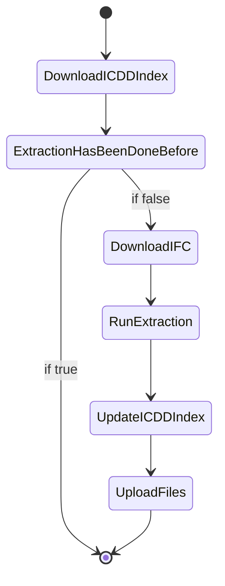

# Introduction 
ifcAPI for using the ifcopenshell library and related packages

# Useful commands
<!-- - Activate python environment: `source ./env/Scripts/activate` -> Apparently only for Linux -->
- Activate python environment: `./env/Scripts/activate`
- Deavtivate environment: `deactivate`
- Install requirements: `pip install -r requirements.txt` or `pip install -r dev-requirements.txt`
- Run on local server with uvicorn: `uvicorn app.main:app --reload`

If the error Permission denied comes up, try to deactivate the venv or restart VS Code. Sometimes it doesn't recognise the user permissions on the project folder.

# Deployment
- Deployment through Render.com (running on a linux server)
- ifcopenshell x64 for linux required! --> ImportError: IfcOpenShell not built for 'linux/64bit/python3.10'

# Getting Started
Get started locally:
1.	Clone repository
2.  Create local environment for python packages: run `python -m venv env` --> creates `env` folder
3.  Activate python environment: `source ./env/Scripts/activate`
3.  Run `pip install -r requirements.txt` to isntall libraries inside your environment
4.  Install some packages manually (download from github and pase into `env\Lib\site-packages`) --> fx ifcpatch or a specific ifcopenshell version
5.	Run `uvicorn app.main:app --reload` to start the api on a local server
6.  Send HTTP-requests to the endpoint `http://127.0.0.1:8000/` and use the methods from this repository (from the `\endpoints` folder)
7.  Extend the endpoints with more ifcopenshell functions and structure them.

If Permission denied --> Set local python path to the python.exe in the env
`python.exe -m pip install gunicorn`
`python.exe -m pip install -r requirements.txt`


# Routes

|Route                                             |Description|Status|
|--------------------------------------------------|-----------|------|
|/main/get-ifc-products/                           |Get all ifc classes in the model|Done|
|/prop/{global_id}/get-properties/                 |Get all properties from an element as JSON|Done|
|/prop/{global_id}/add-property/                   |Add a property to a specific pset. Updated the property value, if the property already existst|Done|
|/prop/{global_id}/add-properties/                 |Adds multiple properties to a specific element|Ongoing|
|/prop/{global_id}/update-property/                |Updates a specific property value. Needed? Already done with add-property method|Ongoing|


## Methods TO DO

Method-routes executes a method on an ifc file to for example find the shortest distance between two objects.

All methods follow this pattern:


### Get Nearest
Get nearest performs a one-to-many search for the nearest neighbour. For example, it could take the GlobalId for a PIR and find the nearest door from a batch of door id's.

Body example:
```json
{
    "sasUrl": "https://webbimstorage.blob.core.windows.net/results/6f6873d3885fd0bd11bee86ebce0eb71/payload_documents/.ifc{{sas}}",
    "sourceURI": "https://web-bim/resources/1111/1hOSvn6df7F8_7GcBWlRGQ",
    "targetURIs": ["https://web-bim/resources/1111/1hOSvn6df7F8_7GcBWlRH8", "https://web-bim/resources/1111/1hOSvn6df7F8_7GcBWlS8Z", "https://web-bim/resources/1111/1hOSvn6df7F8_7GcBWlS9F", "https://web-bim/resources/1111/1hOSvn6df7F8_7GcBWlSFK", "https://web-bim/resources/1111/1hOSvn6df7F8_7GcBWlSDm", "https://web-bim/resources/1111/2OBrcmyk58NupXoVOHUuXp", "https://web-bim/resources/1111/2OBrcmyk58NupXoVOHUvVV", "https://web-bim/resources/1111/2OBrcmyk58NupXoVOHUvR4", "https://web-bim/resources/1111/2OBrcmyk58NupXoVOHUvPL", "https://web-bim/resources/1111/1s1jVhK8z0pgKYcr9jt781", "https://web-bim/resources/1111/1s1jVhK8z0pgKYcr9jt7AB", "https://web-bim/resources/1111/1aj%24VJZFn2TxepZUBcKp%24i", "https://web-bim/resources/1111/2ViC9EPfn9ReiYXGj5lHUo"]
}
```

Result:
```json
{
  "distanceXYZ": 2.170513764065985,
  "distanceXY": 2.170513764065985,
  "distanceX": 2.1169999999999742,
  "distanceY": 0.4789999999999992,
  "distanceZ": 0.0,
  "P1": [
    8.357999999999963,
    -16.879,
    0.0
  ],
  "P2": [
    6.240999999999989,
    -17.358,
    0.0
  ],
  "GlobalId": "1s1jVhK8z0pgKYcr9jt7AB",
  "URI": "inst:1s1jVhK8z0pgKYcr9jt7AB"
}
```


## Transform

Transform-routes process an IFC file and generate some resulting geometry as RDF output.

### BBOX
This method generates Axis Aligned Bounding Boxes (AABB) of all instances of IfcProduct. The center point of these are furthermore calculated. AABBs are defined with a custom WKT conssting of two points (minXYZ and maxXYZ).

Example:
```turtle
@prefix inst: <https://web-bim/resources/1234/> .
@prefix kg:  <https://w3id.org/kobl/geometry#> .
@prefix omg: <https://w3id.org/omg#> .
@prefix fog: <https://w3id.org/fog#> .

inst:0BTBFw6f90Nfh9rP1dlXr2 omg:hasGeometry inst:0BTBFw6f90Nfh9rP1dlXr2_aabb , inst:0BTBFw6f90Nfh9rP1dlXr2_cp .
inst:0BTBFw6f90Nfh9rP1dlXr2_aabb a omg:Geometry , kg:AABB ;
	fog:asSfa_v2-wkt """BBOX Z(0.417000 -17.383000 0.019000, 6.770000 -12.600000 2.600000)""" .
inst:0BTBFw6f90Nfh9rP1dlXr2_cp a omg:Geometry , kg:CenterPoint ;
	fog:asSfa_v2-wkt """POINT Z(3.593500 -14.991500 1.309500)""" .
```

### Tesselate
Extracts all geometries from the IFC and saves them as binary STL-files in the payload_triples folder. These can later be used to produce bounding boxes, calculate distances etc.

```turtle
@prefix inst: <https://web-bim/resources/1234/> .
@prefix kg:  <https://w3id.org/kobl/geometry#> .
@prefix omg: <https://w3id.org/omg#> .
@prefix xsd: <http://www.w3.org/2001/XMLSchema#> .
@prefix fog: <https://w3id.org/fog#> .

inst:0BTBFw6f90Nfh9rP1dlXr2 omg:hasGeometry inst:0BTBFw6f90Nfh9rP1dlXr2_mesh .
inst:0BTBFw6f90Nfh9rP1dlXr2_mesh a omg:Geometry , kg:MeshGeometry ;
	fog:asStl_v1.0 "/payload_documents/0BTBFw6f90Nfh9rP1dlXr2.stl"^^xsd:anyURI .
```

### Mass top polygons
This finds the top surface of all instances of IfcBuildingElementProxy and creates a linestring from its edges:

Example:
```turtle
@prefix inst: <https://web-bim/resources/1234/> .
@prefix kg:  <https://w3id.org/kobl/geometry#> .
@prefix omg: <https://w3id.org/omg#> .
@prefix fog: <https://w3id.org/fog#> .

inst:3CV3Zairr8jfeD_dGkO1LO omg:hasGeometry inst:3CV3Zairr8jfeD_dGkO1LO_top .
inst:3CV3Zairr8jfeD_dGkO1LO_top a omg:Geometry , kg:TopSurface ;
	fog:asSfa_v2-wkt """LINESTRING Z(652981.618200 1177083.763000 12.230000, 652976.761800 1177071.283000 12.230000, 653006.644300 1177063.640000 12.230000, 653010.884500 1177074.536000 12.230000, 653012.515400 1177073.901000 12.230000, 653017.477100 1177086.651000 12.230000, 653007.354000 1177094.086000 12.230000, 653007.365300 1177094.115000 12.230000, 653007.165000 1177094.262000 12.230000, 653002.204100 1177081.514000 12.230000, 652981.618200 1177083.763000 12.230000)""" .
```

### Space polygons
This finds the top surface of all instances of IfcSpace and creates a linestring from its edges:

Example:
```turtle
@prefix inst: <https://web-bim/resources/1234/> .
@prefix kg:  <https://w3id.org/kobl/geometry#> .
@prefix omg: <https://w3id.org/omg#> .
@prefix fog: <https://w3id.org/fog#> .

inst:0BTBFw6f90Nfh9rP1dlXr2 omg:hasGeometry inst:0BTBFw6f90Nfh9rP1dlXr2_top .
inst:0BTBFw6f90Nfh9rP1dlXr2_top a omg:Geometry , kg:TopSurface ;
	fog:asSfa_v2-wkt """POLYGON Z(6.770000 -17.383000 2.600000, 6.770000 -12.600000 2.600000, 0.417000 -12.600000 2.600000, 0.417000 -17.383000 2.600000, 6.770000 -17.383000 2.600000)""" .
```

**Todo:** Currently doesn't support donut rooms. These are handled like `POLYGON Z((loop_A)(loop_B))`. Test with plan viewer!